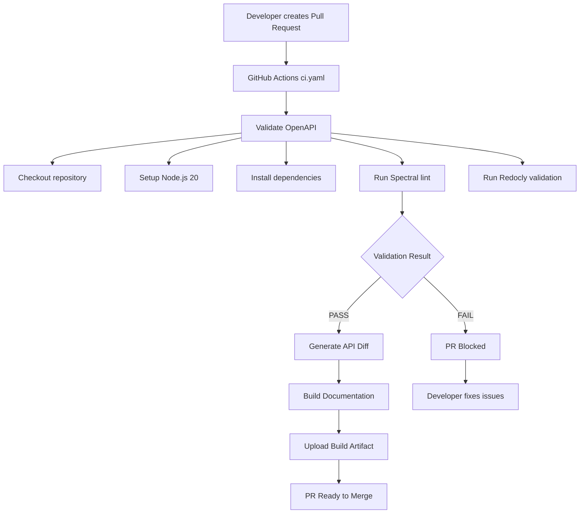
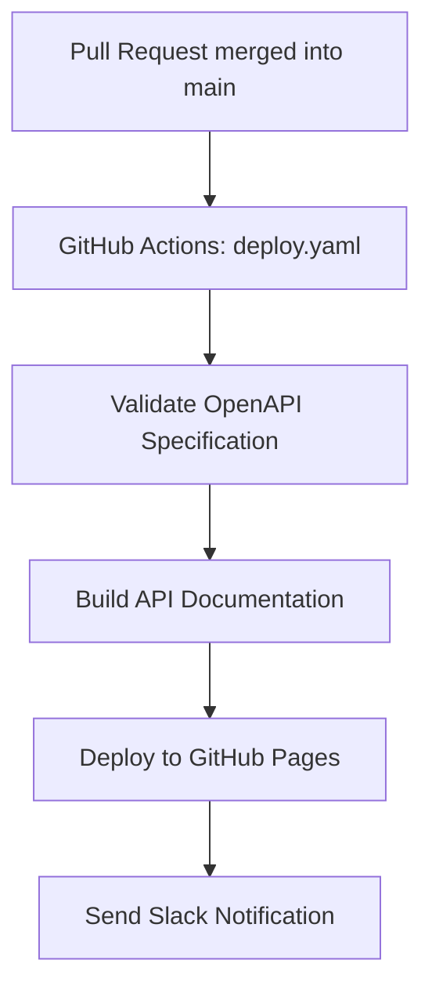

# CI/CD Flow - API Governance

## 📊 Quy trình tự động khi tạo PR

## 🔄 Pull Request Validation Pipeline



---
## 📋 Chi tiết Pipeline

| Bước                | Mô tả                                                                  |
| ------------------- | ---------------------------------------------------------------------- |
| Checkout            | Clone source code từ repository                                        |
| Setup               | Thiết lập môi trường Node.js 20                                        |
| Install             | Cài đặt dependencies bằng `npm ci`                                     |
| Inline Schema Check | Kiểm tra schema inline bên trong thư mục `paths/`                      |
| Spectral Lint       | Kiểm tra `operationId`, `responses`, `readOnly` và các quy tắc đặt tên |
| Redocly Validate    | Kiểm tra cấu trúc và reference của OpenAPI                             |
| Diff Check          | So sánh thay đổi API và comment trực tiếp vào Pull Request             |
| Build Docs          | Sinh OpenAPI bundle và tài liệu HTML                                   |
| Upload Artifact     | Upload artifact build lên GitHub Actions                               |

## 🔄 Quy trình sau khi merge



### Workflow Details

| Stage      | Description                                                 |
| ---------- | ----------------------------------------------------------- |
| Validate   | Kiểm tra lại OpenAPI specification bằng Spectral và Redocly |
| Build Docs | Sinh tài liệu API tự động với `redocly build-docs`          |
| Deploy     | Deploy documentation lên GitHub Pages                       |
| Notify     | Gửi thông báo deploy thành công qua Slack                   |

### Deployment URL

```txt
https://<user>.github.io/<repo>/
```

## ⚡ Timeline ước tính

| Step                | Thời gian | Có thể fail?                  |
| ------------------- | --------- | ----------------------------- |
| Checkout            | ~5s       | Không                         |
| Setup Node          | ~10s      | Không                         |
| npm ci              | ~30s      | Có (nếu package.json lỗi)     |
| Check inline schema | ~2s       | **Có** (nếu có inline schema) |
| Spectral lint       | ~5s       | **Có** (nếu vi phạm rules)    |
| Redocly validate    | ~3s       | **Có** (nếu OpenAPI invalid)  |
| Diff                | ~5s       | Không                         |
| Build docs          | ~10s      | Có (nếu bundle lỗi)           |
| **Tổng**            | **~70s**  |                               |

## 🎯 Các điểm kiểm tra quan trọng

### ✅ Sẽ PASS nếu:
- Không có inline schema trong `paths/`
- operationId đúng format `verbNoun`
- Trường `id`, `created_at`, `updated_at` có `readOnly: true`
- OpenAPI syntax hợp lệ

### ❌ Sẽ FAIL nếu:
- Có inline schema trong `paths/`
- operationId sai format
- Thiếu `readOnly` cho các trường bắt buộc
- OpenAPI syntax lỗi
- Circular references

### ⚠️ WARNING (không block PR):
- Thiếu response 401, 404, 500
- Thiếu description
- Thiếu examples

## 🔧 Debug khi CI fail

### 1. Xem logs trong GitHub Actions
```
Actions tab → Click vào run → Click vào failed job
```

### 2. Chạy lại local
```bash
npm run lint:api
```

### 3. Kiểm tra từng bước
```bash
# Chỉ check inline schema
bash scripts/lint-all.sh

# Chỉ Spectral
npm run lint:spectral

# Chỉ Redocly
npm run validate:api
```
